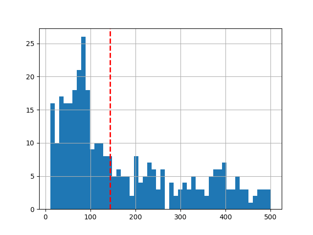
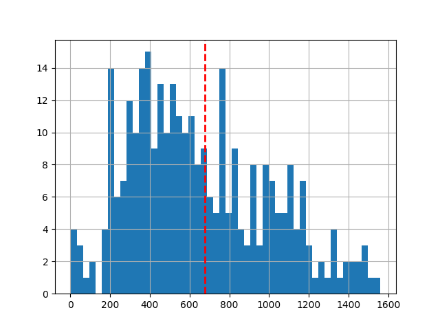
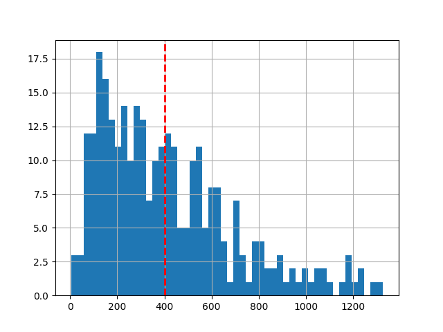
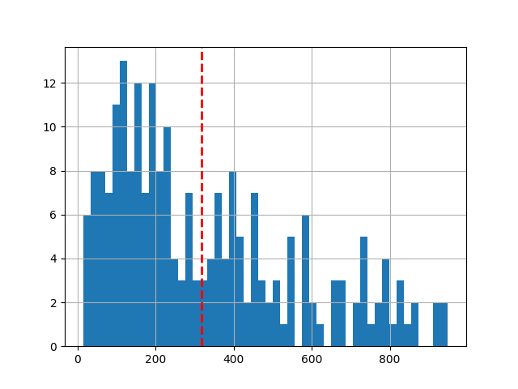
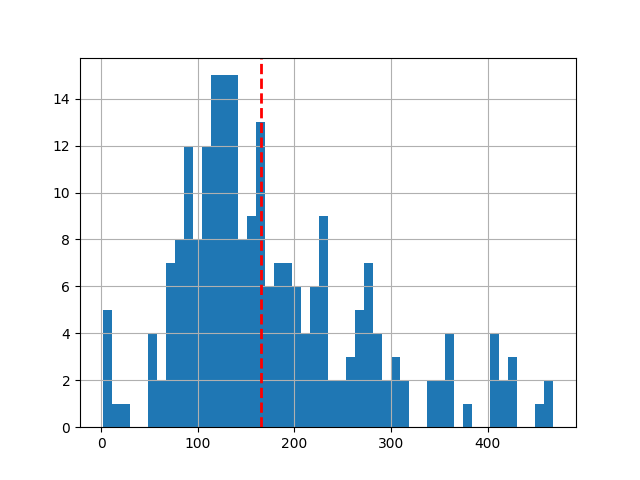
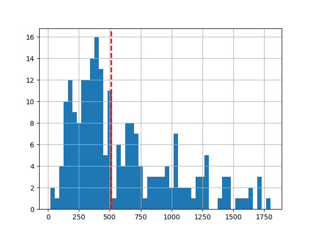
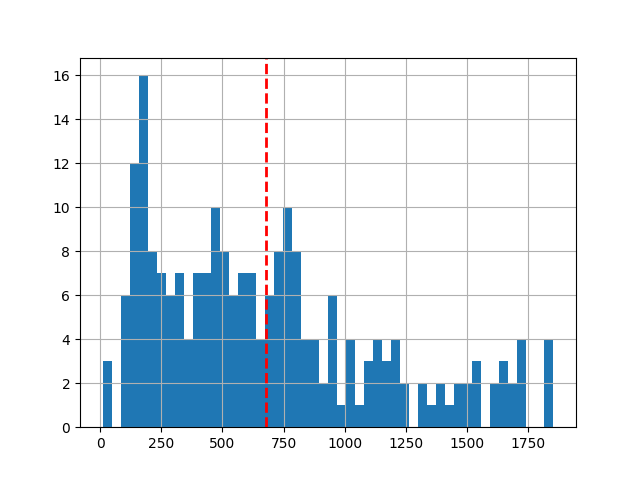
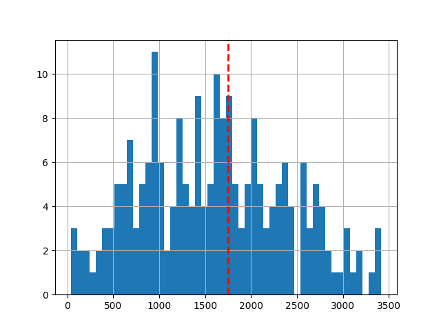

### Week 1 
#### 001.Nimi 
 
#### 002.HeiMaailma 
 
#### 003.Kuusi 
 
#### 004.Muuttujat 
 
#### 005.SekunnitVuodessa 
 
#### 006.Yhteenlasku 
 
#### 007.Kertolasku 
 
#### 008.Summaaja 
 
#### 009.Jakaja 
 
#### 010.YmpyranKehanPituus 
 
#### 011.SuurempiLuku 
 
#### 012.IkienSumma 
 
#### 013.RobottiOhjain 
 
#### 014.PositiivinenLuku 
 
#### 015.TaysiIkaisyys 
 
#### 016.ParitonVaiParillinen 
 
#### 017.SuurempiLuku 
 
#### 018.ArvosanatJaPisteet 
 
#### 019.IanTarkastus 
 
#### 020.Kayttajatunnukset 
 
#### 021.Karkausvuosi 
 
#### 022.Salasana 
 
#### 023.Lampotiloja 
 
#### 024.RobottiOhjainOsa2 
 
### Week 2 
#### 025.KolmenLuvunSumma 
 
#### 026.UseammanLuvunSumma 
 
#### 027.YhdestaSataan 
 
#### 028.SadastaYhteen 
 
#### 029.ParillisetLuvut 
 
#### 030.MihinJaMista 
 
#### 031.Portaikko 
 
#### 032.LukusarjanSumma 
 
#### 033.RajatunLukusarjanSumma 
 
#### 034.Kertoma 
 
#### 035.PotenssienSumma 
 
#### 036.SilmukatLopetusMuistaminen 
 
#### 037.TekstinTulostus 
 
#### 038.MontaTulostusta 
 
#### 039.Tulostelua 
 
#### 040.TulosteluaLikeABoss 
 
#### 041.Numerovisa 
 
#### 042.Viivakimara 
 
### Week 3 
#### 043.LukujenSumma 
 
#### 044.Pienin 
 
#### 045.Suurin 
 
#### 046.LukujenKeskiarvo 
 
#### 047.NimenPituus 
 
#### 048.EnsimmainenKirjain 
 
#### 049.ViimeinenKirjain 
 
#### 050.EnsimmaisetKirjaimet 
 
#### 051.KirjaimetErikseen 
 
#### 052.NimenKaantaminen 
 
#### 053.Alkuosa 
 
#### 054.Loppuosa 
 
#### 055.SanaSanassa 
 
#### 056.MerkkijononKaantaminen 
 
#### 057.Sanat 
 
#### 058.ToistuvaSana 
 
#### 059.SanatKaanteisesti 
 
#### 060.SanatAakkosjarjestyksessa 
 
#### 061.LaskeAlkiot 
 
#### 062.PoistaViimeinen 
 
#### 063.LukujenSumma 
 
#### 064.LukujenKeskiarvo 
 
#### 065.Suurin 
 
#### 066.Varianssi 
 
#### 067.OnkoLukuListalla 
 
#### 068.Palindromi 
 
#### 069.KaikkiEri 
 
#### 070.Yhdistelya 
 
#### 071.Fotari 
 
### Week 4 
#### 072.1.EnsimmainenTilisi 
 
#### 072.2.EnsimmainenTilisiirtosi 
 
#### 072.3.Tilisiirtoja 
 
#### 073.Tuote 
 
#### 074.Kertoja 
 
#### 075.VahenevaLaskuri 
 
#### 076.Ruokalista 
 
#### 077.Maksukortti 
 
#### 078.KelloLaskurinAvulla 
 
#### 079.Lukutilasto 
 
#### 080.Noppa 
 
#### 081.SalasananArpoja 
 
#### 082.Lottoarvonta 
 
#### 083.HirsipuuLogiikka 
 
### Week 5 
#### 084.KuormitettuLaskuri 
 
#### 085.Kasvatuslaitos 
 
#### 086.MaksukorttiJaKassapaate 
 
#### 087.Asuntovertailu 
 
#### 088.Opiskelija 
 
#### 089.KellostaOlio 
 
#### 090.JoukkueetJaPelaajat 
 
#### 091.Paivays 
 
#### 092.PaivamaarienErotus 
 
#### 093.HenkilonIka 
 
### Week 6 
#### 094.Puhelinmuistio 
 
#### 095.Raha 
 
#### 096.TaulukonLukujenSumma 
 
#### 097.TyylikasTulostus 
 
#### 098.KopiointiJaKaantaminen 
 
#### 099.TaulukkoTahtina 
 
#### 100.Tahtitaivas 
 
#### 101.KirjastonTietojarjestelma 
 
#### 102.Arvosanajakauma 
 
#### 103.Tietokanta 
 
#### 104.Jarjestaminen 
 
#### 105.Arvauspeli 
 
#### 106.Binaarihaku 
 
#### 107.Kurssipalaute 
 
#### 108.AlykasMato 
 
